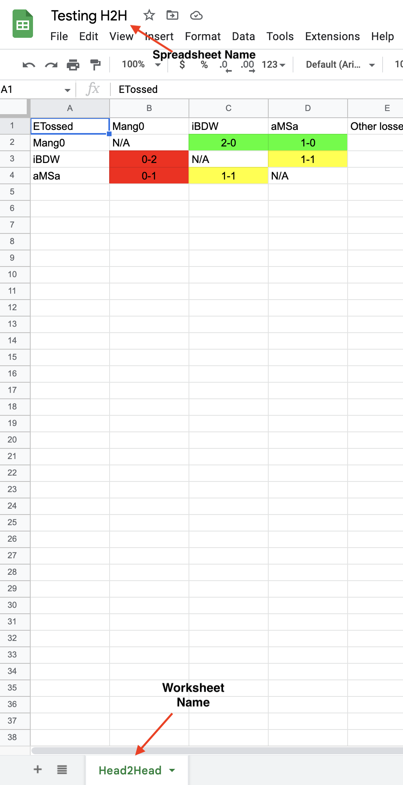

# Matchup GG
## Purpose of the code
This is a script to create MU charts for given players within the parameters of given events that you would like it to check on. It will create 2 google sheets charts. The first is the head to head for the desired players, and the second is a list of all wins and losses for each given player.

## Setup
There are a few parts you will have to do by hand before this can be ran. After setting up your python env, and [getting a start.gg developer account](https://developer.start.gg/docs/intro) you will need to do the following. 

### Get event IDS
There are a few ways of doing this. The easiest way is to go to the [start.gg api explorer](https://developer.start.gg/explorer) and run a query to get the event IDS. The start.gg api is built using GraphQL which is worth learning to understand the queries, as well as making your own. The slug for the desired tournament is from the url of the tournament. In this case, https://www.start.gg/tournament/take-notes-msu-texas/details becomes tournament/take-notes-msu-texas. Here is an example of the query:
```GraphQL
query TournamentQuery {
        tournament(slug: "tournament/take-notes-msu-texas"){
            name
            events {
                id
                name
            }
        }
    }
```
This query returns the following results
```json
{
  "data": {
    "tournament": {
      "name": "Take Notes @MSU Texas",
      "events": [
        {
          "id": 995242,
          "name": "Smash Ultimate Singles"
        },
        {
          "id": 995243,
          "name": "Smash Ultimate Doubles"
        },
        {
          "id": 995244,
          "name": "Street Fighter 6"
        }
      ]
    }
  },
  "extensions": {
    "cacheControl": {
      "version": 1,
      "hints": [
        {
          "path": [
            "tournament"
          ],
          "maxAge": 300,
          "scope": "PRIVATE"
        }
      ]
    },
    "queryComplexity": 4
  },
  "actionRecords": []
}
```
Take note of the id of the event that you want to use, in this case `995242` for singles. In `main.py` there is an empty list at the top called `events`. Write down a list of the events id's that you want to use, like the following:
```python
[995242,969493]
```
It is important that there are no spaces between the commas and the next value

### Get player IDs
Go to the users start.gg profile page. For example, for the player streams, the user page link is https://www.start.gg/user/b7c78cda. The last part `b7c78cda` is the players ID. Keep a list of the players and corresponsing slugs that you would like to use, formatted like the following:
```python
[Demothen,de8f2797,streams,b7c78cda,TeS|Puente,a3e41b97]
```
It is important that there are no spaces between the commas and the next value. Ordinarily, you do not need to include the player sponsor tag in their name, Puente however has TeS as part of his tag instead of it being under the sponsor part in start.gg, therefore it needs to be added.

### Connect to Google Sheets
- You must have a Service Account created through Google to connect service to the spreadsheet. To create one [Follow these instruction](https://docs.gspread.org/en/v5.7.0/oauth2.html#enable-api-access-for-a-project) up to downloading the JSON file. Take a note of where it is saved. Change the variable `pathToSpreadsheetJSON` in main to match the file path
- Create the google sheet you would like to have the information put into, and press the share option and add the email of the service account that you created as an editor for the spreadsheet. 
- 
- 
- Also note the difference between the `Spreadsheet Name` and the `Worksheet Name` 
- 

## Running
To make this program more accessible, I took the liberty of setting up a GitHub Action to run it. To run this action, go to the Actions Tab of this repository and find the action named [Create Matchup Spreadsheet](https://github.com/oddsorevans/matchupGG/actions/workflows/create_spreadsheet.yml). Once there choose `Run Workflow` and simply fill in the information. To correctly format the googleAuth information, you must do 2 things in order: 
1. Format the json to be a single line. You can do this by running it through a [single line online formatter](https://www.text-utils.com/json-formatter/).
2. Stringify the now one line json. This can also be done using a [stringify online formatter](https://jsonformatter.org/json-stringify-online).
It may be a concern to you to upload sensitive information, such as your start.gg auth token, or googleauth information, but the workflow will hide your inputs in the console so no one can see them.

You can of course also run this locally. To do so, you can either run the script `./github/scripts/run-spreadsheet` which has information included on how to run if you include the `-h` tag after the script name, or you can directly run `main.py` with some modifications to where it recieves the data that is normally passed through the script. The code is written for a unix file system.